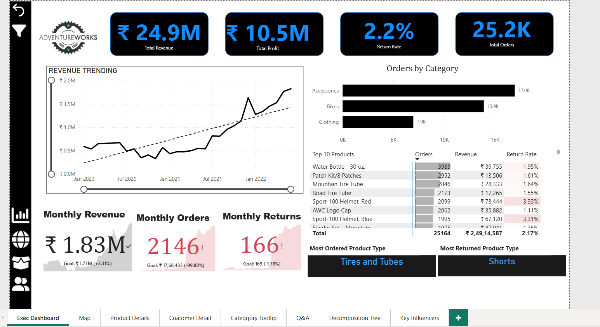

# AdventureWorks Sales Analytics Dashboard | Power BI

## Project Overview

This project presents an end-to-end Business Intelligence solution built using Microsoft Power BI on the AdventureWorks dataset. The dashboard analyzes sales performance, profitability, customer behaviour, product performance, regional sales, and return trends.

The project demonstrates data modeling, DAX calculations, Power Query transformations, KPI reporting, and interactive dashboard development.

---

## Tools Used

- Microsoft Power BI
- Power Query
- DAX (Data Analysis Expressions)
- Data Modeling
- Excel

---

## Dashboard Features

✔ Executive Dashboard

✔ Interactive Map Analysis

✔ Product Performance Dashboard

✔ Customer Analysis Dashboard

✔ Category Tooltip

✔ Q&A Visual

✔ Decomposition Tree

✔ Key Influencers Visual

---

## Key KPIs

- Total Revenue
- Total Profit
- Total Orders
- Total Customers
- Return Rate
- Revenue per Customer
- Quantity Sold
- Quantity Returned

---

## DAX Concepts Used

- Time Intelligence
- Rolling Period Calculations
- YTD Analysis
- Target vs Actual Analysis
- KPI Measures
- Customer Metrics
- Product Metrics

---

## Data Model

The project follows a Star Schema.

Fact Tables

- Sales Data
- Returns Data

Dimension Tables

- Calendar Lookup
- Customer Lookup
- Product Lookup
- Territory Lookup
- Product Categories
- Product Subcategories

---

## Business Insights

- Accessories generated the highest number of orders.

- The business generated over $24.9M in total revenue.

- High-performing territories contributed a significant share of overall sales.

- Return rates differed across product categories, highlighting areas for quality improvement.

- A relatively small group of customers contributed a large portion of total revenue.

## Dashboard Screenshots

### Executive Dashboard

### Map Analysis

### Product Performance Dashboard

### Customer Analysis Dashboard

